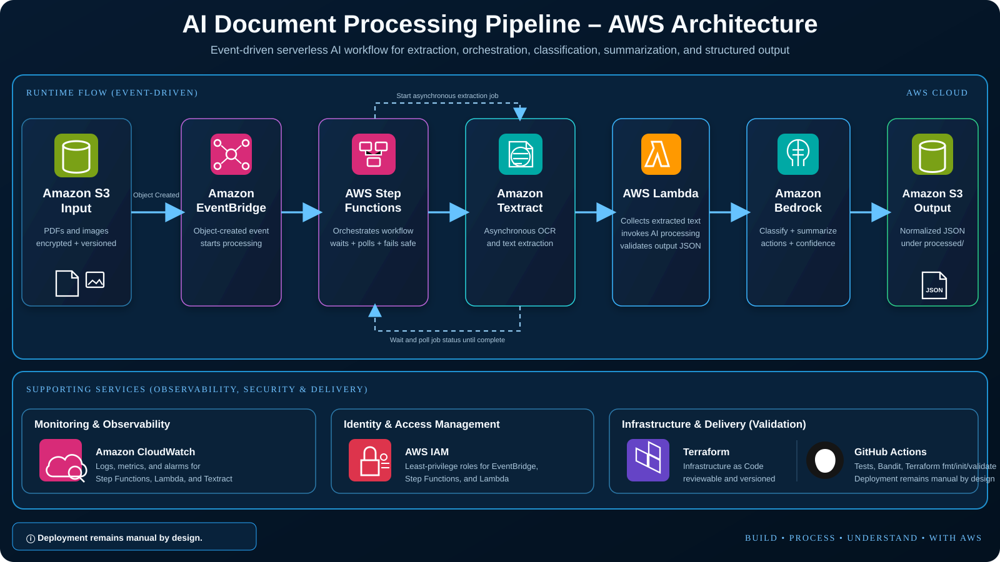
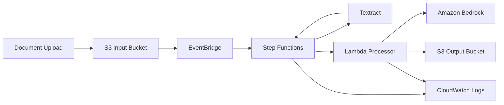

# AI Document Processing Pipeline

A serverless AWS portfolio project for extracting text from uploaded documents, classifying and summarizing the content with Amazon Bedrock, and writing structured results to a protected output bucket. The workflow is event-driven and orchestrated with AWS Step Functions.

## What this project demonstrates

- Amazon S3 event-driven document ingestion
- Amazon EventBridge routing to Step Functions
- Asynchronous Amazon Textract text extraction
- Step Functions polling and failure handling
- AWS Lambda post-processing
- Amazon Bedrock classification and summarization
- Structured JSON output written to a separate S3 bucket
- Least-privilege IAM roles for Step Functions, Lambda, and EventBridge
- S3 encryption, versioning, and Block Public Access
- CloudWatch logging for workflow and Lambda execution
- Terraform infrastructure as code
- Automated Python tests, Bandit scanning, and Terraform validation in GitHub Actions

## Architecture





## Processing flow

1. A PDF or image is uploaded to the input S3 bucket.
2. S3 publishes an object-created event to EventBridge.
3. EventBridge starts the Step Functions state machine.
4. Step Functions starts an asynchronous Textract text-detection job.
5. The workflow waits and polls Textract until extraction succeeds or fails.
6. Lambda collects all extracted text pages.
7. Lambda asks Amazon Bedrock to classify the document, summarize it, and identify action items.
8. The result is normalized into JSON and written to the output S3 bucket.

## Repository structure

```text
ai-document-processing-pipeline/
├── README.md
├── dashboard.html
├── src/
│   ├── document_logic.py
│   └── processor.py
├── tests/
│   └── test_document_logic.py
├── terraform/
│   ├── versions.tf
│   ├── variables.tf
│   ├── main.tf
│   └── outputs.tf
├── docs/
│   ├── architecture.md
│   └── deployment-guide.md
└── .github/workflows/validate.yml
```

## Local validation

```bash
python -m unittest discover -s tests -v
cd terraform
terraform fmt -check -recursive
terraform init -backend=false
terraform validate
```

## Deployment

```bash
cd terraform
terraform init
terraform plan
terraform apply
```

After deployment, upload a supported document to the `input_bucket_name` output. Processed JSON results are written beneath the `processed/` prefix in the output bucket.

## Bedrock model

The model ID is configurable with the `bedrock_model_id` Terraform variable. The default is `amazon.nova-lite-v1:0`. Use a model that is enabled and available in your selected AWS Region.

## Security design

- No public S3 access
- S3 versioning and server-side encryption enabled
- No long-lived credentials stored in the repository
- Separate IAM roles for orchestration, processing, and event delivery
- Lambda can only read Textract results, invoke Bedrock, and write to the designated output bucket
- Step Functions can only read the input bucket, call Textract, invoke the processor Lambda, and write execution logs
- Deployment is intentionally manual because it creates billable AWS resources

## Portfolio status

The application logic, Terraform, tests, architecture documentation, dashboard, and CI validation workflow are implemented. AWS deployment remains environment-specific and is not automatically applied to a production account.
